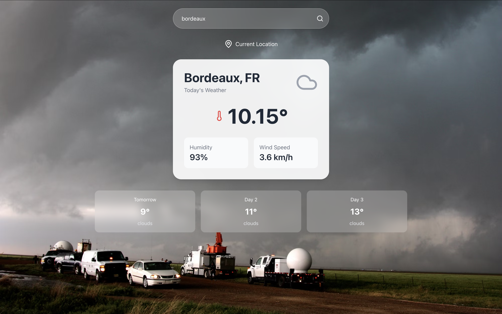

# Weather App

A simple weather application built with React and Vite that fetches and displays weather data from OpenWeatherMap.

## Features

- Search for current weather by city.
- Display temperature, weather conditions, andother relevant information.
- Clean and modern UI.

## Preview



## Prerequisites

Before you begin, ensure you have the following installed on your machine:

- Node.js (v16 or higher)
- npm (comes with Node.js)

## Installation

1.	Clone the repository:

```bash
git clone https://github.com/raphael-pietrzak/weather-app.git
cd weather-app
```

2.	Install dependencies:

```bash
npm install
```


3.	Set up your API key:

<!-- - Go to OpenWeatherMap and create a free account if you don’t already have one. -->
<!-- https://openweathermap.org/ -->
<!-- fusionner le lien avec le texte ci-dessous -->

- Go to [OpenWeatherMap](https://openweathermap.org/) and create a free account if you don’t already have one.
- Generate an API key from your account dashboard.
- Create a .env file in the root of your project and add your API key:

```.env
VITE_WEATHER_API_KEY=your_openweathermap_api_key
```

## Running the App

1. Start the development server:

```bash
npm run dev
```

2. Open your browser and navigate to:

http://localhost:5173

3. Search for a city to view the current weather.


## License

This project is licensed under the MIT License.

## Contact

For questions or feedback, please reach out to `raphael.pietrzak@ynov.com`

Enjoy using the Weather App! 🌦️